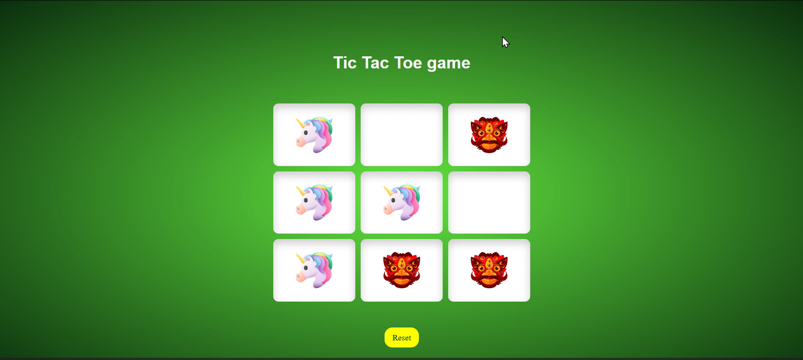

# Varsha Jethwa Portfolio Website

Welcome to my portfolio website! This project was part of my internship Task 4, showcasing my web development skills through a responsive and interactive portfolio site.

---

## 🖥️ Features

- **Responsive Design**: Works on desktop, tablet, and mobile.
- **Hero Section**: Introduction with a call-to-action button and resume download.
- **About Section**: Highlights my skills and technologies with floating icons.
- **Projects Section**: Interactive project cards with hover effects and GitHub links.
- **Contact Section**: Contact form integrated with Formspree.
- **Download Resume**: Direct download button for my resume.

---

## ⚡ Technologies Used

- HTML5  
- CSS3  
- JavaScript  
- Google Fonts (Poppins)  
- Formspree for contact form  

---
## 💻 Projects

| Project | Screenshot | GitHub Link |
|---------|------------|-------------|
| Land Resources Website |  | [View Project](https://github.com/vjethwa2005/land_resources_website.git) |
| Beauty Salon Website |  | [View Project](https://github.com/vjethwa2005/BeautySalonAppointmentManagement.git) |
| Stopwatch Timer |  | [View Project](https://github.com/vjethwa2005/PRODIGY_WD_02.git) |
| Tic Tac Toe Game |  | [View Project](https://github.com/vjethwa2005/PRODIGY_WD_03.git) |
| Password Generator |  | [View Project](https://github.com/vjethwa2005/react/tree/main/05passwordGenerator) |

---

## 📧 Contact

You can contact me using the form in the **Contact Section** of the website directly.
- LinkedIn: [LinkedIn](https://www.linkedin.com/in/varsha-jethwa-1bab0028b/)  
- GitHub: [vjethwa2005](https://github.com/vjethwa2005)

---

## 📄 Resume

Click the **Download Resume** button on the website or [download here](./Varsha_Jethwa.pdf).

---

## 🚀 How to Run

1. Clone this repository:
```bash
git clone https://github.com/vjethwa2005/portfolio.git

